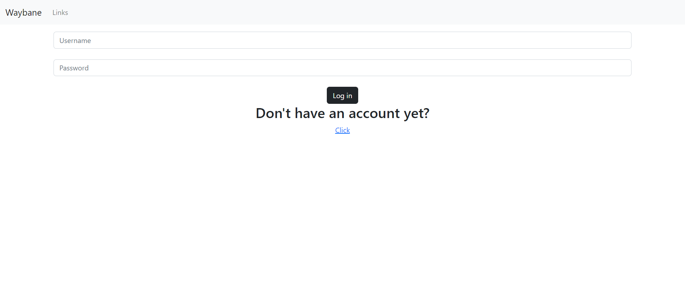
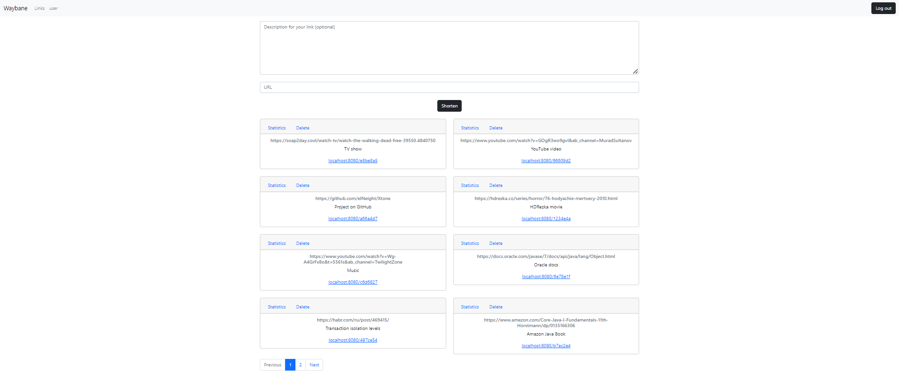
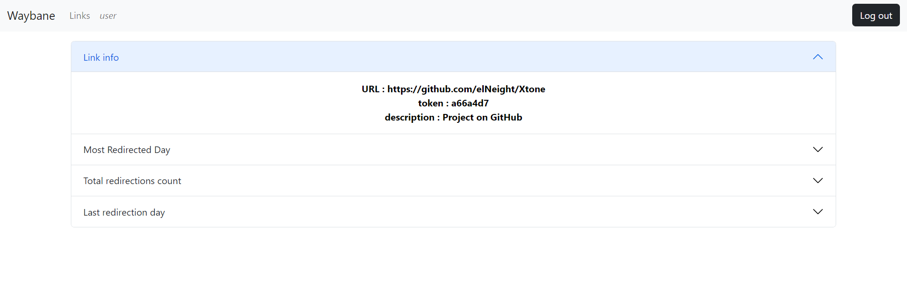

# Waybane

## What is it?
Waybane is a multi-user link shortener.

## Shortener features

Waybane provides abilities to generate tiny links for it long analogs. It also allows users to
have access to link statistics which are full link info(URL, short token, description),
most redirected day and redirection count for that day, total redirection count and last redirection day.
Short links are also available for any person who has it, so you don't need to be signed in to use them.

## How to use it?

Firstly it asks users to sing in or create an account. After successful authentication it provides 
form for links. Basically there is an optional field for link description. The second field in the form
is for the link itself. The link card allows users to either delete link or take a look at its statistics.

### Example

## Technologies

- Spring Boot,
- Spring Data JPA,
- Spring Security,
- Spring MVC,
- Thymeleaf,
- Maven,
- MySQL.